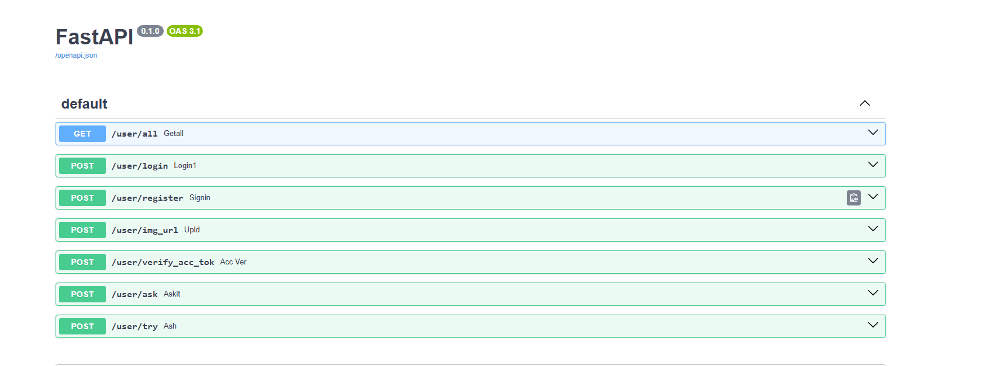
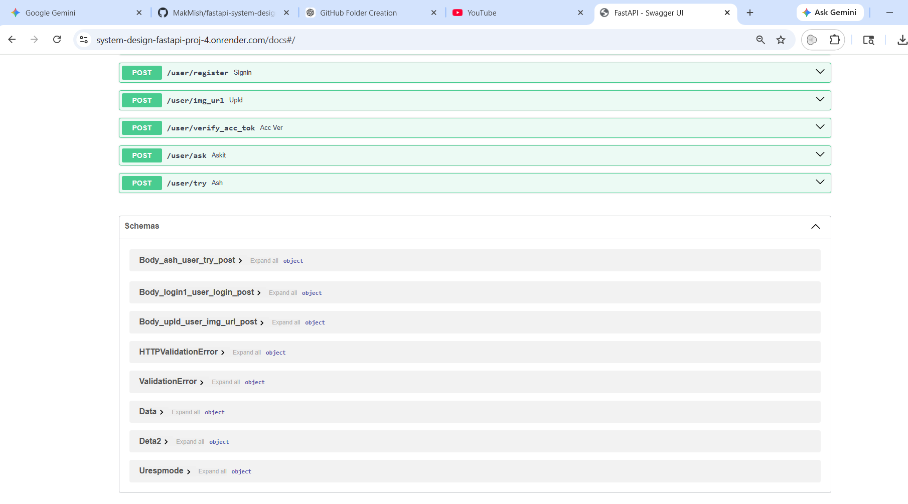
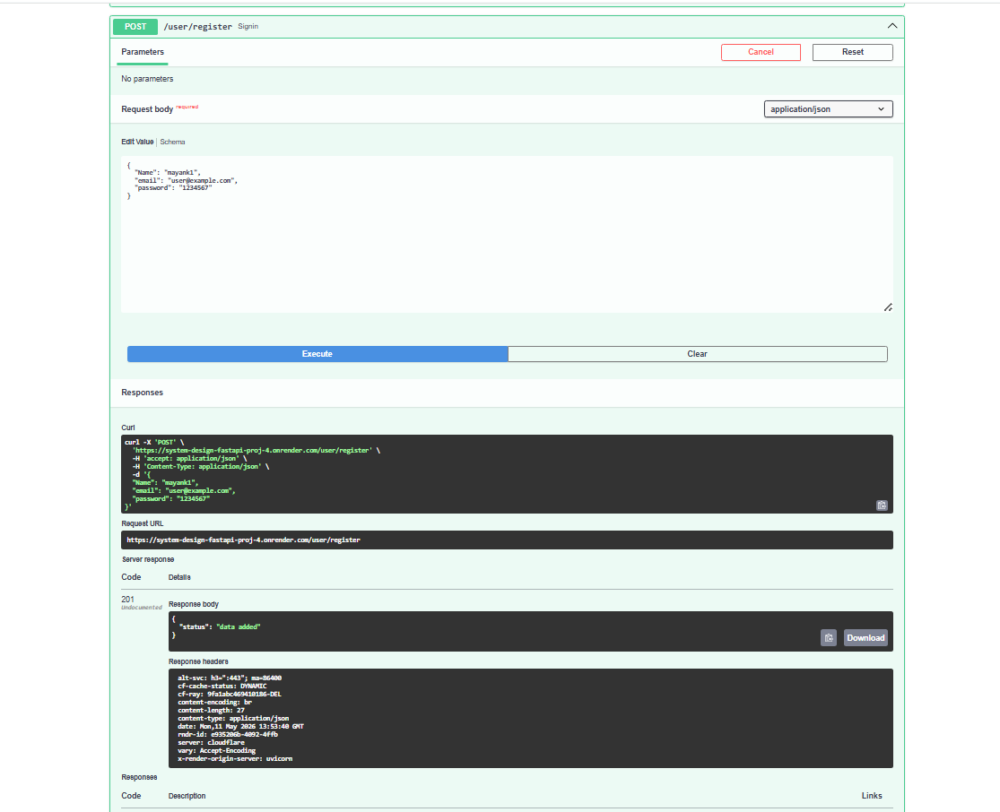
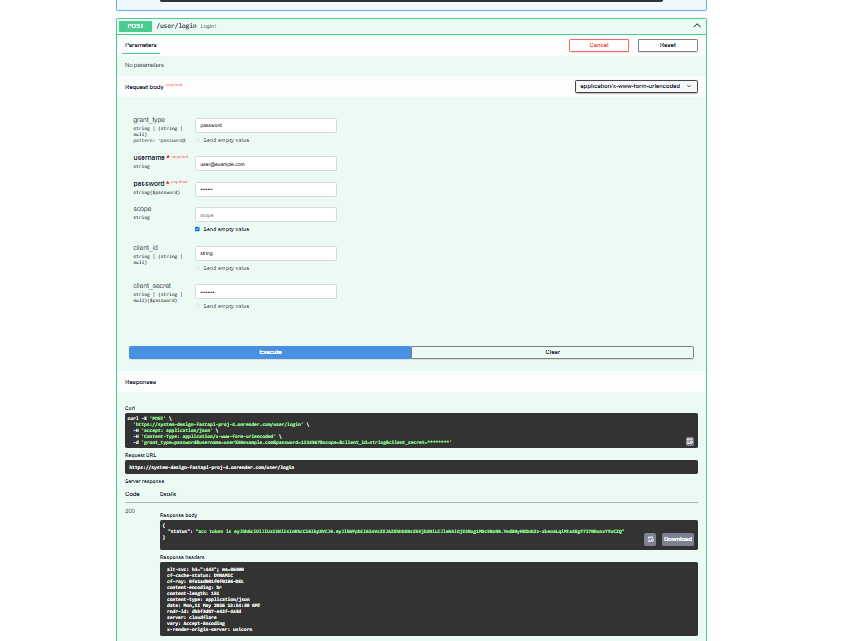
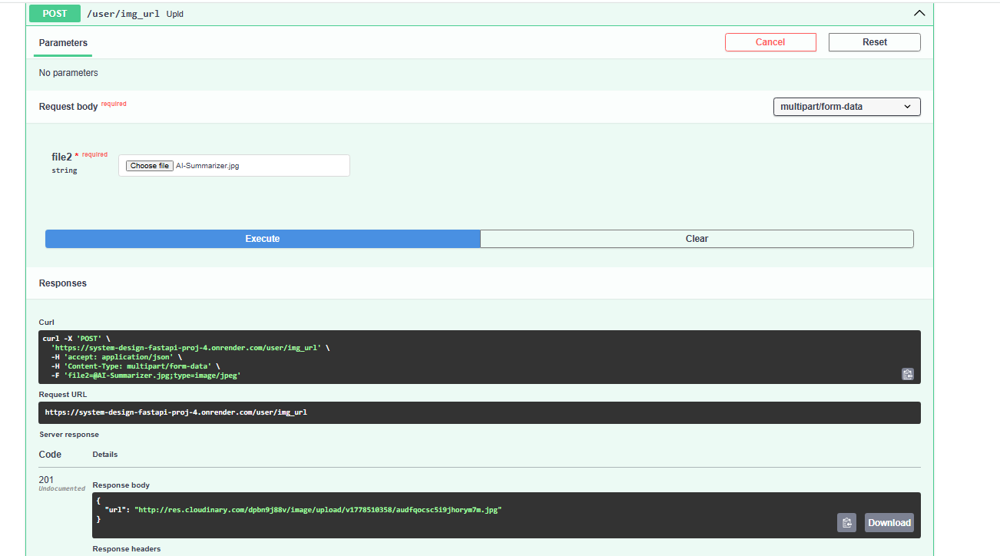
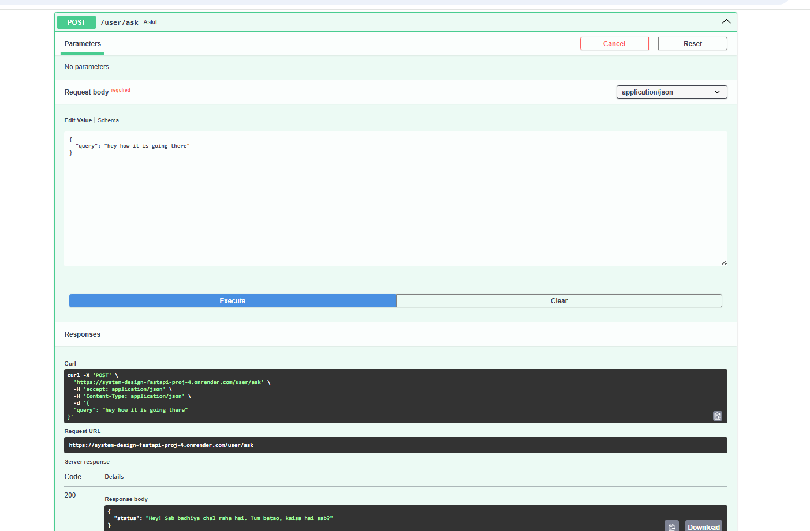
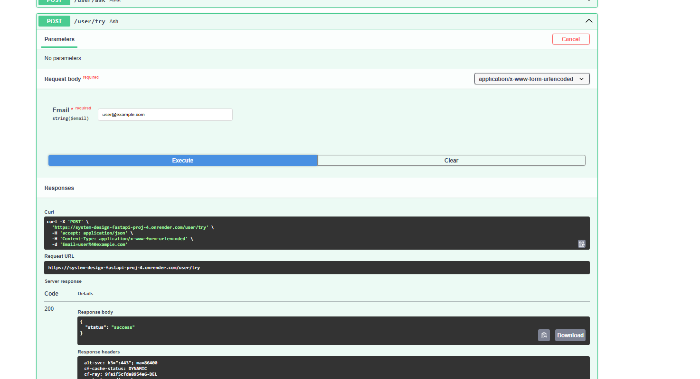

# 🚀 FastAPI System Design Project

A production-ready backend system built using **FastAPI** focused on **scalability, asynchronous architecture, and performance optimization**.

This project demonstrates real-world backend engineering concepts including:

- JWT Authentication & Authorization
- Redis Caching
- Celery Background Tasks
- Rate Limiting
- Async Programming
- Docker Containerization
- AI Integration
- Cloudinary Image Uploads
- Alembic Database Migrations
- Email Scheduling
- Performance Testing with Locust
- Deployment on Render

---

# 🔥 Live API Documentation

👉 https://system-design-fastapi-proj-4.onrender.com/docs

---

# 🧠 System Design Highlights

✅ Asynchronous FastAPI Architecture  
✅ Redis-powered Performance Optimization  
✅ Celery Worker for Background Jobs  
✅ JWT-based Secure Authentication  
✅ Dockerized Deployment  
✅ Rate Limiting for API Protection  
✅ AI-powered API Endpoint  
✅ Cloudinary Media Storage  
✅ Database Versioning using Alembic  
✅ Production Deployment on Render  

---

# ⚡ Performance Improvements

Load testing was performed using **Locust** to analyze scalability and API throughput.

## 📈 Results After Optimization

| Metric | Before Optimization | After Optimization |
|---|---|---|
| Requests Per Second (RPS) | 98+ RPS | 320+ RPS |
| Failure Rate | High | Reduced to 1.17% |
| Response Time | Slower | Improved significantly |
| Redis Optimization | ❌ | 57% Faster |
| Celery Background Tasks | ❌ | Faster API Response |

---

# 🛠️ Tech Stack

## Backend
- FastAPI
- PostgreSQL
- SQLAlchemy
- Alembic

## Authentication
- JWT Access Tokens
- Password Hashing

## Performance & Scaling
- Redis
- Celery
- Async Programming
- Rate Limiting

## Cloud Services
- Cloudinary
- Render

## DevOps
- Docker
- Docker Compose

## Testing
- Locust

---

# ✨ Features

## 🔐 Authentication System
- User Registration
- Secure Login
- JWT Access Token Verification
- Password Hashing

## ☁️ Cloudinary Image Upload
- Upload user images directly to cloud storage
- Returns hosted image URL

## 🤖 AI Integration
- AI-powered endpoint using asynchronous processing

## ⚡ Celery Background Tasks
- Email sending handled asynchronously
- Scheduled email execution after 2 minutes
- Faster API response handling

## 🚦 Rate Limiting
- Prevents API abuse
- Improves server stability during heavy traffic

## 🧠 Redis Optimization
- Faster request processing
- Reduced response time
- Improved throughput under load

## 🐳 Dockerized Deployment
- Fully containerized backend setup
- Easy production deployment

---

# 📸 API Screenshots

## Swagger UI Main Page





---

## User Registration API



---

## JWT Authentication API



---

## Cloudinary Image Upload API



---

## AI Support Endpoint



---

## Celery Email Scheduling



---

## Celery & Redis Worker Logs

The image below demonstrates:

- Celery worker startup
- Redis broker connection
- Task queue initialization
- Background task execution
- Successful task processing in production


---

# ⚙️ Background Task Workflow

## Redis Connection Established
- Celery successfully connected to Redis broker
- Queue initialized properly

## Celery Worker Ready
- Worker started successfully inside deployed container
- Task listener activated

## Task Received & Executed
- Background email task received
- Task processed asynchronously
- API remained responsive during execution

---

# 🚀 Asynchronous Architecture Benefits

✅ Non-blocking API responses  
✅ Faster request handling  
✅ Better scalability under heavy traffic  
✅ Improved user experience  
✅ Efficient background processing  

---

# 🧠 Production-Level Concepts Implemented

- Celery Distributed Task Queue
- Redis Message Broker
- Async FastAPI Architecture
- Dockerized Worker Deployment
- Background Email Scheduling
- Queue-based Task Processing

---

# 📊 Performance Impact

Using Redis + Celery + Async Programming resulted in:

| Improvement | Result |
|---|---|
| Response Time | Improved |
| API Throughput | 320+ RPS |
| Failure Rate | Reduced to 1.17% |
| Redis Optimization | 57% Faster |
| Background Tasks | Fully Asynchronous |

---

# 🧪 Load Testing

Locust was used to simulate concurrent users and measure:

- Request throughput
- API latency
- Failure rate
- Redis optimization impact
- Rate limiting effectiveness

## Key Observations

✅ Redis improved API performance by **57%**  
✅ Failure rate dropped to **1.17%**  
✅ API throughput increased from **98+ RPS to 320+ RPS**  
✅ Celery significantly improved response handling  

---

# 🐳 Docker Setup

```bash
docker-compose up --build
```

---

# 🚀 Run Locally

## Clone Repository

```bash
git clone <your_repo_link>
cd <repo_name>
```

## Create Virtual Environment

```bash
python -m venv venv
```

## Activate Environment

### Windows

```bash
venv\Scripts\activate
```

### Linux / Mac

```bash
source venv/bin/activate
```

## Install Requirements

```bash
pip install -r requirements.txt
```

## Run Alembic Migrations

```bash
alembic upgrade head
```

## Start FastAPI Server

```bash
uvicorn main:app --reload
```

---

# 📂 Project Structure

```bash
├── app
├── routers
├── models
├── schemas
├── database
├── celery_tasks
├── migrations
├── docker-compose.yml
├── Dockerfile
├── requirements.txt
└── README.md
```

---

# 🎯 Why This Project Matters

This project was built to explore:

- Backend scalability
- Distributed task processing
- Production-grade API architecture
- System design concepts
- Performance optimization
- Real-world deployment workflows

It reflects practical backend engineering concepts used in scalable applications.

---

# 👨‍💻 Author

## Mayank Mishra

Backend Developer focused on:

- FastAPI
- System Design
- Scalable Backend Architectures
- Async Programming
- Docker & Deployment
- AI-integrated APIs
